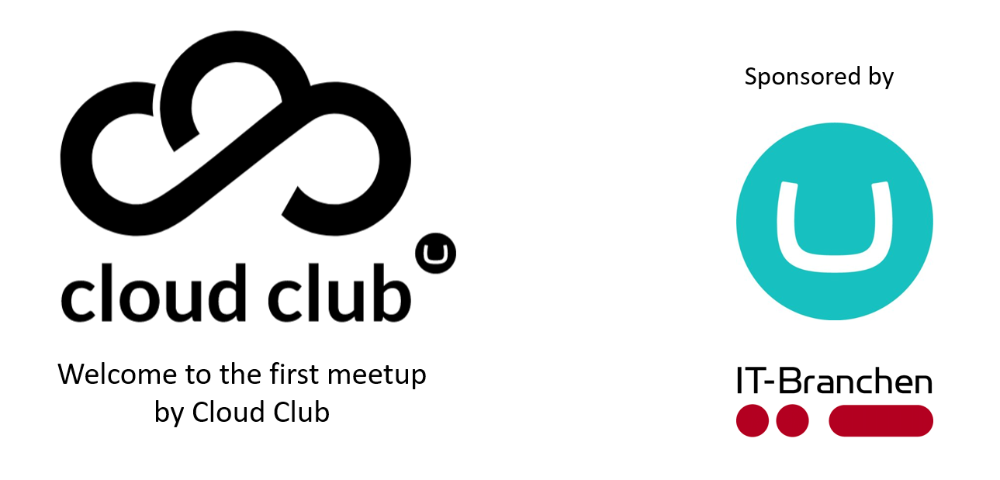
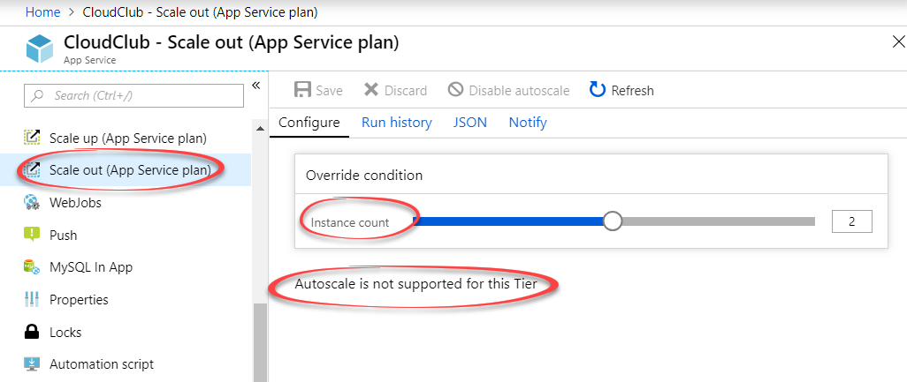
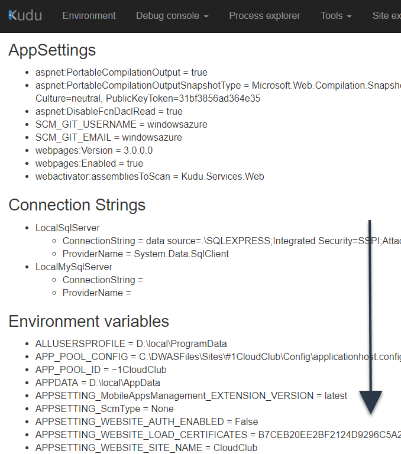
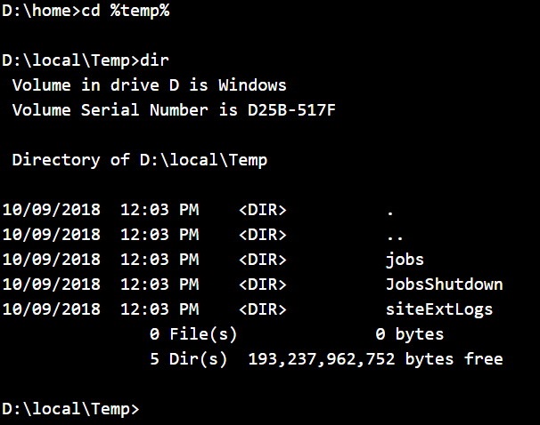
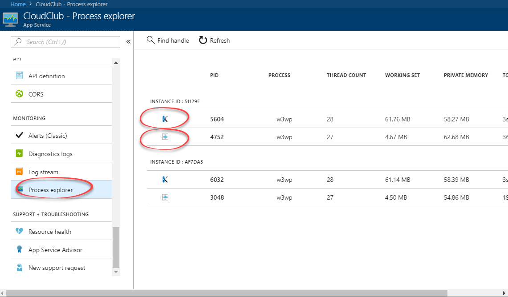
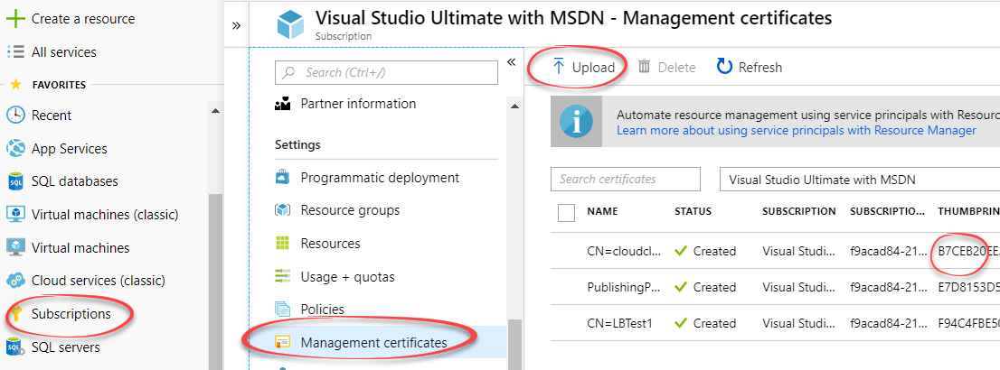
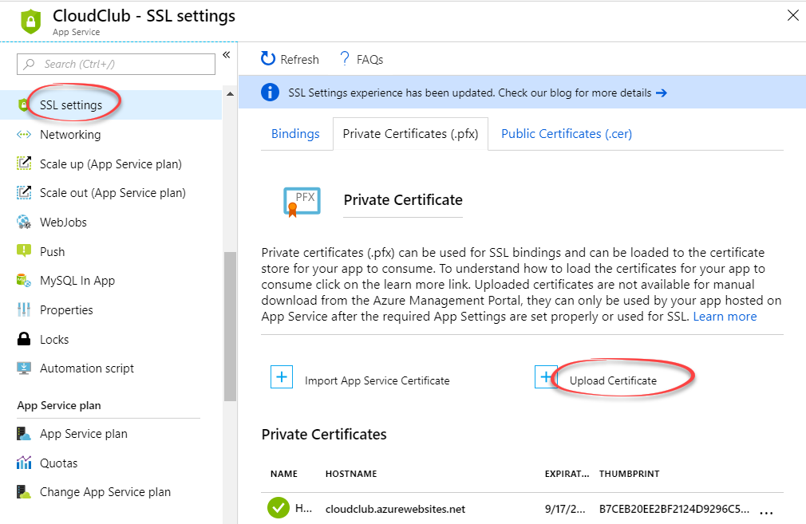
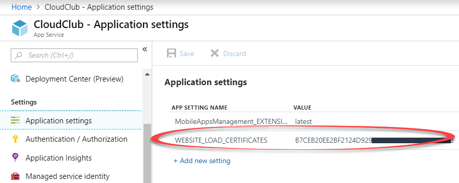
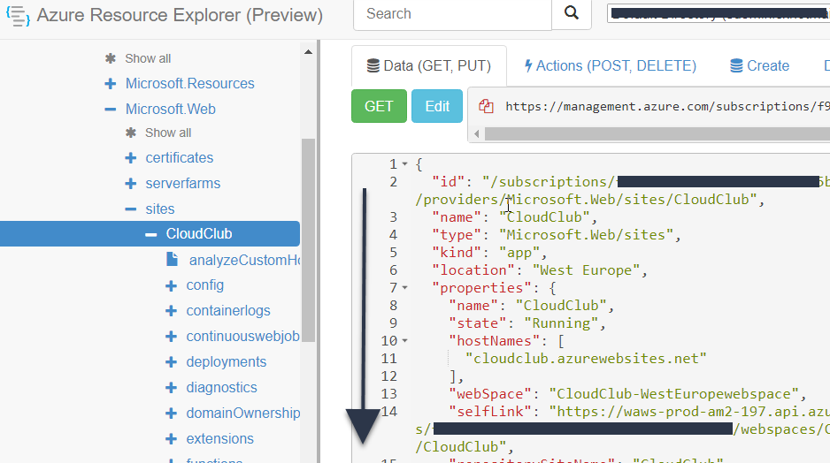

---
@transition[none]



---
@title[Introduction]
@transition[none]

## Load balancing & Azure web apps
_Tips and tricks, beyond the normal click'n scale_

@snap[south]
<small>Shannon Deminick (Umbraco)<br/>@shazwazza<br/>shazwazza.com</small>
@snapend

Note:

* Introduce yourself
* You might already know some of this
* If you're not a coder, there is some code
---
@transition[fade]

### How to load balance<br/>(scale out)



Note:

* This is how you load balance
* Done!

---

### What happens when<br/> scaling (out)?

@ul
* How it's stored @fa[exclamation-circle]
* What's created
* How to access each node
* How to talk to each node
@ulend

---

### Why do I care?

@ul
* Curious
* Debugging
* Testing
* Performance @fa[exclamation-circle]
* Knowing the right development practices @fa[exclamation-circle]
* Caching @fa[exclamation-circle]
@ulend

---
@title[two hard things in Computer Science]

@quote[There are only two hard things in Computer Science: cache invalidation and naming things.](Phil Karlton)

---

@title[Demo website]

#### [https://cloudclub.azurewebsites.net/]()

---
@transition[fade]

### How are files stored in Azure websites?

@ul
* All instances share the same files
* Website files are stored on a network drive
@ulend

Note:

- Both of these points are extremely important

--- 
@transition[fade]

### Slow drive vs Fast drive

@ul
* Network file shares are __slow__
* Each site has it's own temporary __fast drive__
* `Environment.ExpandEnvironmentVariables("%temp%")`]
    * Resolves to `D:\local\Temp`
* ASP.Net's Codegen files are local too
@ulend

Note:

* There are limits
* Fast drive is TEMPORARY

---
@transition[fade]

### Azure App Service Local Cache

*Essentially means your site runs entirely on the <br/>__fast drive__*

```

WEBSITE_LOCAL_CACHE_OPTION='Always'

WEBSITE_LOCAL_CACHE_SIZEINMB='2000'

```

@snap[south]
_Is this for me?_
@snapend

---
@transition[fade]

### More mysterious settings ...

---
@transition[fade]

@snap[midpoint]

@snapend

---

### Lets see it...

---
@transition[fade]

### Odd ASP.Net settings

* `aspnet:*` (_are built directly into ASP.Net_)
* `aspnet:PortableCompilationOutput`
* `aspnet:PortableCompilationOutputSnapshotType`
* `aspnet:DisableFcnDaclRead`

---
@transition[fade]

### Kudu settings

* `WEBSITE_*`
* `SCM_*`
* `DIAGNOSTICS_*`
* [https://github.com/projectkudu/kudu<br/>/wiki/Configurable-settings](https://github.com/projectkudu/kudu/wiki/Configurable-settings)

---
@transition[fade]

### Where are my fast drive files?



---
@transition[fade]

### Where are my fast drive files?

```

WEBSITE_DISABLE_SCM_SEPARATION='true'

```

---
@transition[fade]

@quote[When separation is enabled, the main site and scm site run in different sandboxes. <br/><br/>With separation, the Main and scm sites each have their own local files. <br/><br/>So you won't see the Main site's temp files from Kudu console.](Kudu)

--- 

### Process Explorer

@transition[fade]



---
@transition[fade]

### File locks

@quote[All instances share the same files](Cloud Club)

---
@transition[fade]

### File locks

* Saving files to the __slow__ drive must be unique
* _i.e._ `/App_Data/{MachineName}-{AppDomainAppId}-log.txt`

---

### What happens<br/>when scaling out?
@transition[fade]

@ul
* A new IIS instance is created on another server
* Settings files are copied locally
* Centralized IIS configuration is applied 
* The website is added to the load balancer
* .... but ... 
@ulend

---
@transition[fade]

### How can I debug this?

* What if your users are getting intermittent errors?
* How do you know if an instance is healthy?

---
@transition[fade]

### How to get site instance info?

@ul
* Each instance  can __push__ their information to storage
* We can __pull__ this information from Azure APIs
@ulend
---
@transition[fade]

### Push the info with web jobs

@ul
* Can provide any local instance info
* Requires checking for stale instances
* ... a webjob runs as a process on each instance!
@ulend

---

### Push the info with web jobs

```cs
static void Main(string[] args)
{
    var instanceId = Environment
        .GetEnvironmentVariable("WEBSITE_INSTANCE_ID");
    var serverName = Environment.MachineName;
    var baseDir = Path.Combine(
        Environment.ExpandEnvironmentVariables("%HOME%"), 
        "site", "wwwroot");
    while (true)
    {
        Console.WriteLine(
            $"{instanceId} - {serverName} - {baseDir}");
        try
        {
            UpdateFile(baseDir, instanceId, serverName);
        }
        catch (Exception ex)
        {
            Console.WriteLine($"ERROR: {ex}");
        }
        Thread.Sleep(30000); //30 seconds
    }
}
```

@[3-4](Get the instance id)
@[5](Get the server name)
@[6-8](Get the wwwroot folder for the website)
@[9-10,21-23](Run every 30 seconds)
@[11-20](Create/Update a json file)

---

### Lets see it...

---
@transition[fade]

### Use the .NET Azure API

* More robust way of getting instance Ids
* No need for stale instance checking
* Doesn't provide any local info

---
@transition[fade]

### Use the .NET Azure API

```bash
PM> Install-Package 
     Microsoft.WindowsAzure.Management.WebSites 
        -Version 5.0.0-prerelease
```
@snap[south]
<small>Sadly this library isn't .NET Core friendly @fa[frown-o]</small>
@snapend

---
@transition[fade]

### The management<br/> certficate dance @fa[certificate]

@quote[If you do this enough times<br/> it gets less annoying](Shannon Deminick)

@snap[south]
<small>To use the websites SDK we need to setup credentials</small>
@snapend

---
@transition[fade]
@title[Certificate dance 2]

### Management certficates<br/> for websites

* Generate a self signed cert locally
* Export the PFX and CER files

---

@title[Certificate dance script]

```bash
$rootCert = New-SelfSignedCertificate `
    -CertStoreLocation cert:\CurrentUser\My `
    -DnsName "cloudclub.azurewebsites.net" `
    -TextExtension @("1.3.6.1.4.1.311.21.10={text}1.3.6.1.5.5.7.3.1,1.3.6.1.5.5.7.3.2")
$rootCertPassword = ConvertTo-SecureString  
    -String "YouCanNeverGuessThisPassword" `
    -Force -AsPlainText
$rootCertPath = Join-Path -Path 'cert:\CurrentUser\My\' `
    -ChildPath "$($rootCert.Thumbprint)"
Export-PfxCertificate -Cert $rootCertPath `
    -FilePath 'cloudclub.azurewebsites.net.pfx' `
    -Password $rootCertPassword
Export-Certificate -Cert $rootCertPath `
    -FilePath 'cloudclub.azurewebsites.net.cer'
```

@[1-4](Generate the cert)
@[5-7](Define a password)
@[8-9](Store it in CurrentUser storage)
@[10-12](Export the PFX)
@[13-14](Export the CER)

---
@transition[fade]
### Add the CER to the subscription


---
@transition[fade]
### Add the PFX to the website



---
@transition[fade]
### Use thumbprint

_Added to app settings_

```

WEBSITE_LOAD_CERTIFICATES='123456789asdfasdfasdf'
```
---
@transition[fade]
### Use thumbprint



---

### Using the API (cert)

```cs
using (var certStore = new X509Store(
        StoreName.My, StoreLocation.CurrentUser))
{
    certStore.Open(OpenFlags.ReadOnly);
    var certCollection = certStore.Certificates.Find(
        X509FindType.FindByThumbprint,
        ConfigurationManager.AppSettings["WEBSITE_LOAD_CERTIFICATES"],
        false);
    if (certCollection.Count > 0)
    {
        var cert = certCollection[0];
        return new CertificateCloudCredentials(subscriptionId, cert);
    }
    throw new InvalidOperationException("Could not find certificate");
}
```

@[5-7](Find the cert by thumbprint - were not storing any sensitive info)
@[12](This is the object we want)

---

### Using the API (client)

```cs
var client = new WebSiteManagementClient(credentials);
//webspaceName = "CloudClub-westeuropewebspace"
//websiteName = "CloudClub"
return await client.WebSites
        .GetInstanceIdsAsync(webspaceName, websiteName);
```

@[1](Create a client with the credentials)
@[2-5](Get the instance Ids)

---
@transition[fade]
### Webspace<br/>names

<small>
`"CloudClub-westeuropewebspace"`
</small>

@snap[south]
<small>Very slim documentation</small>
@snapend

@snap[north-east]
<small>
South Central US<br/>
North Europe<br/>
West Europe<br/>
Southeast Asia<br/>
East Asia<br/>
West US<br/>
East US<br/>
Japan West<br/>
Japan East<br/>
East US 2<br/>
North Central US<br/>
Central US<br/>
Brazil South<br/>
Australia East<br/>
Australia Southeast<br/>
Canada Central<br/>
Canada East<br/>
West Central US<br/>
West US 2<br/>
UK West<br/>
UK South<br/>
Korea South<br/>
Korea Central<br/>
</small>
@snapend

@snap[north-west]
<small>
eastuswebspace<br/>
westuswebspace<br/>
northcentraluswebspace<br/>
northeuropewebspace<br/>
westeuropewebspace<br/>
eastasiawebspace<br/>
</small>
@snapend

---
@transition[fade]



---
@transition[fade]
### Lets see it all working

---
@transition[fade]
### How do I access a specific instance?

* `ARRAffinity` cookie (i.e. Sticky sessions)
* Value is the instance Id 
* Allows you to debug/test a specific instance
* HttpOnly

---

### How do I access a specific instance?

```cs
[HttpPost]
public ActionResult ChangeWorkers(string instanceId)
{
    var arrCookie = Request.Cookies.Get("ARRAffinity");
    if (arrCookie == null) throw new InvalidOperationException("No ARRAffinity cookie found");
    Response.Cookies.Remove("ARRAffinity");
    arrCookie.Value = instanceId;
    arrCookie.Domain = $".{Request.Url.Host}";
    Response.SetCookie(arrCookie);
    return RedirectToAction("Index");
}
```

@[4-6](Get the current cookie and remove it from the response)
@[7](Update the cookie value to the instance id)
@[8](Ensure the domain is prefixed with '.')
@[9-10](Add to the response and redirect)

---
@transition[fade]
### Health status @fa[medkit]

@ul
* Manually checking each worker isn't ideal
* How do we make a centralized health check?
@ulend

---
@transition[fade]

### Worker -> Worker communication

* It is possible to send requests between workers
* `ARRAffinity` cookie FTW

---
@transition[fade]

### Worker -> Worker communication

```cs
var cookieContainer = new CookieContainer();
using (var handler = new HttpClientHandler { 
            CookieContainer = cookieContainer })
{
    using (var httpClient = new HttpClient(handler))
    {
        cookieContainer.Add(url, new Cookie("ARRAffinity", instanceId));
        return await httpClient.GetAsync(url);
    }
}
```

@[5](New HttpClient instance!)
@[7](Set the ARRAffinity cookie to the instance id)
@[8](Send the request)

---
@transition[fade]
### Lets see it all working

---
@transition[fade]

### Site warmup

_If my site isn't ready, don't send requests to it!_

```xml
<system.webServer>
    <applicationInitialization >
        <add initializationPage="/home/info" 
                hostName="cloudclub.azurewebsites.net"/>
    </applicationInitialization>
</system.webServer>
```

@[3-4](The health check pages, there can be multiple)

---
@transition[fade]

### Site warmup

@ul
* For cache warmups
* Index building
* Maybe any runtime compilation
@ulend

---
@transition[fade]

### Questions?


@snap[south]
Shannon Deminick<br/>
@shazwazza<br/>
shazwazza.com<br/>
@snapend